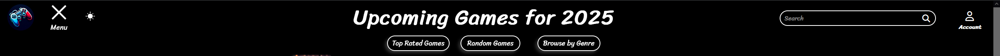

# Getting Started
Run the app on your local server(localhost:5501).

**User will need to provide their own API key from.** https://rawg.io/apidocs

Clicking on the "menu" will display multiple buttons for the user to choose from.

Users can read the description of each game by hovering over a selected game.

The search bar can be used to look up a specific title, games will show up that are close to the provided title name.

At the bottom of the page the user can go to the next page by clicking on the "next" button and go to the previous page by clicking on the "prev" button.

By clicking on the Menu button the user will have the option to click on "Top Rated Games", "Random Games" or "Browse by Genre".

Clicking on the "Top Rated Games" button will display top rated games based on its metacritic rating and user rating according to rawg api.

Clicking on "Random Games" will display a random set of games for the user to browse.

Clicking on "Browse by Genre" will display a list of genres which the user will then need to choose a desired genre to browse by. After clicking a genre games based on that genre will be displayed.

Clicking on the "Account" button on the top right of the screen will display a sign in button and a create account button.

Users will be able to sign in to their account if they have an existing account and if not they can create an account.

When signed in users can add games of their choosing to either "Completed", "Want To Play", or "Currently Playing" lists.

These three lists can be accessible when signed in by clicking on "User's Game List".

Each list dynamically displays the games selected by the user for that category.

When within one of these lists the users can then delete any game they select.

Dark mode can be toggled by clicking on the "moon" symbol.

# Files

* index.html : This file contains the HTML code for the app.
* style.css : This file contains the CSS code for the app.
* script.js : This file contains the JavaScript code for the apps functionality.
* db.js : This file contains the code for the MongoDB database connection.
* user.js : This file contains the code for the Schema named User for the database.
* server.js : This file contains the code for caching responses and all the API GET's and POST's. 
* images Folder : This folder contains the images which are used in the README, icon, and logo.

API used from: https://rawg.io/apidocs